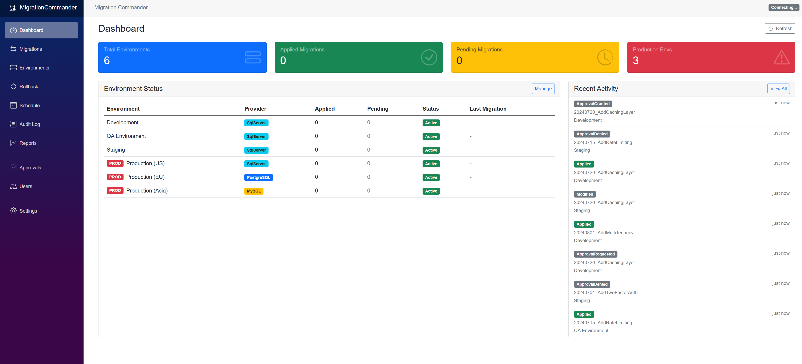
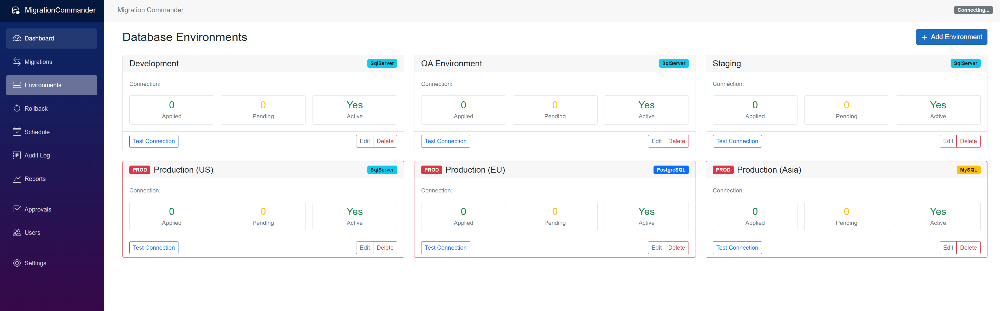
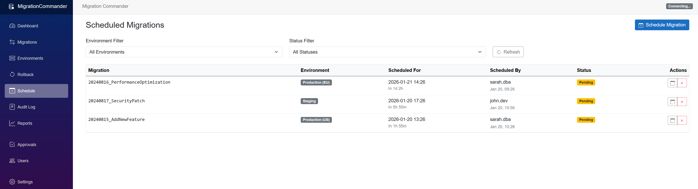
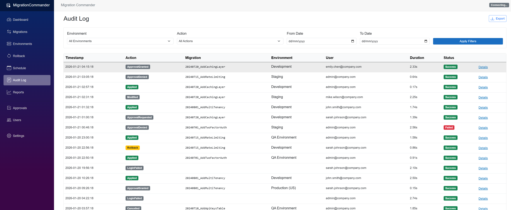
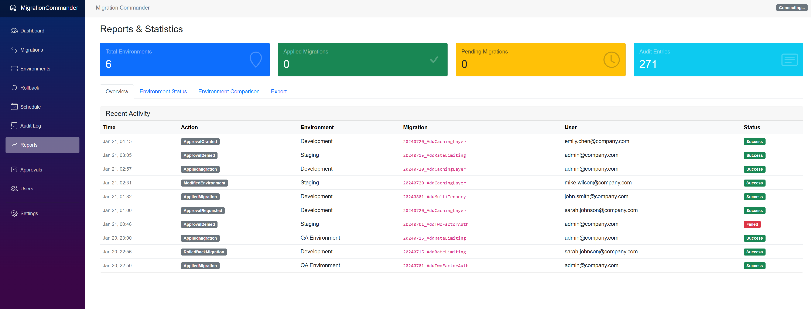
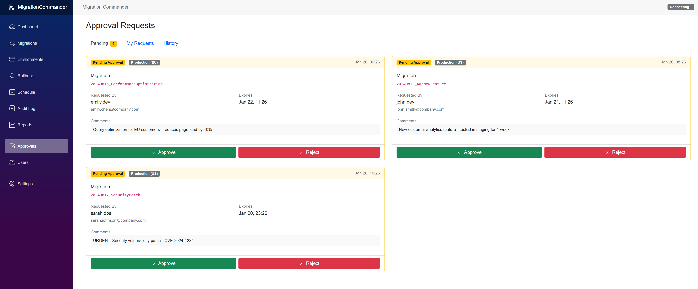
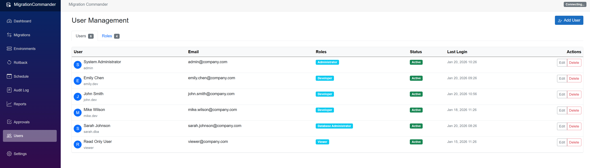
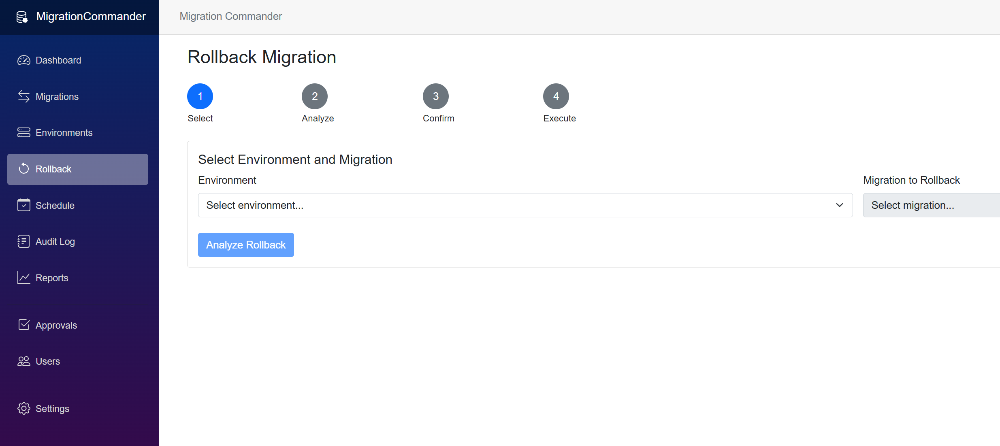
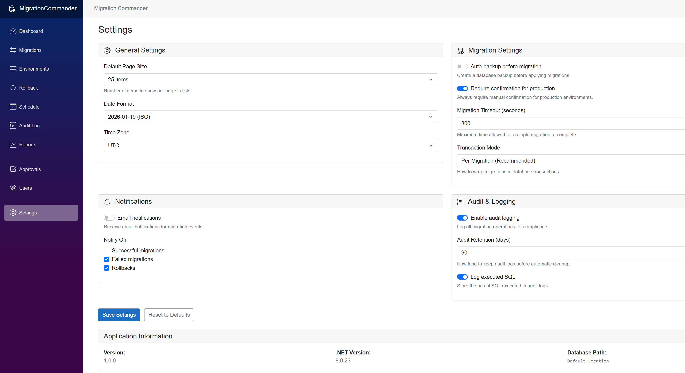

<p align="center">
  
</p>

<h1 align="center">MigrationCommander</h1>

<p align="center">
  <strong>Enterprise Database Change Governance Platform</strong>
</p>

<p align="center">
  <em>"Air Traffic Control" for your database migrations - ensuring no change happens without proper governance, visibility, and safety measures.</em>
</p>

<p align="center">
  <a href="#features"></a>
  <a href="#"></a>
  <a href="#"></a>
  <a href="#"></a>
  <a href="#code-metrics"></a>
  <a href="#design-patterns"></a>
  <a href="#"></a>
</p>

<p align="center">
  <a href="#quick-start">Quick Start</a> •
  <a href="#screenshots">Screenshots</a> •
  <a href="#features">Features</a> •
  <a href="#real-world-use-cases">Use Cases</a> •
  <a href="#architecture">Architecture</a> •
  <a href="#design-patterns">Design Patterns</a> •
  <a href="#technical-deep-dive">Technical Deep Dive</a> •
  <a href="docs/PROJECT_DOCUMENT.md">Business Document</a> •
  <a href="docs/TECHNICAL_DOCUMENT.md">Technical Document</a>
</p>

---

## Executive Summary

**MigrationCommander** is an enterprise-grade database change governance platform that transforms how organizations manage their most critical and risky IT operations: database migrations.

**Key Value Proposition:** Eliminate database deployment disasters by bringing enterprise-grade governance, approval workflows, and complete audit trails to your database migration process - reducing risk, ensuring compliance, and giving stakeholders peace of mind.

Think of MigrationCommander as **"GitHub + Jira + Audit Log, but specifically for database changes."**

---

## The Problem: Why This Exists

### The "Dave" Problem

> *"Remember when Dave ran that migration in production on Friday afternoon and we spent the entire weekend recovering?"*

Every engineering team has that story. Database migrations are the **single riskiest operation** in software deployment. Unlike code deployments that can be rolled back in seconds, database changes can:

- **Corrupt or permanently delete** business-critical data
- **Take down production** for hours or days
- **Violate compliance** and regulatory requirements
- **Result in significant financial and reputational damage**

### The Cost of NOT Having Governance

| Risk | Without MigrationCommander | With MigrationCommander |
|------|---------------------------|-------------------------|
| **Production Incidents** | Frequent, unplanned | Rare, controlled |
| **Recovery Time** | Hours to days | Minutes (with rollback) |
| **Compliance Audits** | Manual, incomplete | Automated, comprehensive |
| **Team Stress** | High (fear of deployments) | Low (confidence in process) |
| **Weekend Emergencies** | Common | Virtually eliminated |

### Who Suffers From This Problem?

- **CTOs & VPs of Engineering**: Responsible when things go wrong
- **Database Administrators**: Blamed for every data issue
- **Developers**: Afraid to deploy database changes
- **Compliance Officers**: Struggling to prove audit trails exist
- **Operations Teams**: Cleaning up after failed migrations
- **Business Stakeholders**: Losing revenue during outages

---

## The Solution

**MigrationCommander** is the command center for database changes. It transforms database migrations from a high-risk manual process into a governed, auditable, automated workflow.

```
┌─────────────────────────────────────────────────────────────────────────────┐
│                    MIGRATIONCOMMANDER WORKFLOW                               │
├─────────────────────────────────────────────────────────────────────────────┤
│                                                                              │
│   Developer writes migration                                                 │
│            │                                                                 │
│            ▼                                                                 │
│   ┌─────────────────┐    ┌──────────────────┐    ┌─────────────────────┐   │
│   │   DISCOVERY     │───▶│  PREVIEW & RISK  │───▶│      APPROVAL       │   │
│   │                 │    │    ANALYSIS      │    │      WORKFLOW       │   │
│   │ Auto-detect all │    │                  │    │                     │   │
│   │ pending changes │    │ See exact SQL,   │    │ Multi-approver,     │   │
│   └─────────────────┘    │ risk warnings    │    │ expiring requests   │   │
│                          └──────────────────┘    └─────────────────────┘   │
│                                                           │                 │
│                                                           ▼                 │
│   ┌─────────────────┐    ┌──────────────────┐    ┌─────────────────────┐   │
│   │  COMPLETE AUDIT │◀───│  SAFE EXECUTION  │◀───│     SCHEDULED       │   │
│   │     TRAIL       │    │   & ROLLBACK     │    │    DEPLOYMENT       │   │
│   │                 │    │                  │    │                     │   │
│   │ Who, what, when │    │ Real-time        │    │ Run during          │   │
│   │ from where      │    │ progress, auto   │    │ maintenance windows │   │
│   └─────────────────┘    │ rollback         │    └─────────────────────┘   │
│                          └──────────────────┘                               │
│                                                                              │
└─────────────────────────────────────────────────────────────────────────────┘
```

---

## Screenshots

### Dashboard
Real-time overview of all environments, migration status, and recent activity with SignalR-powered live updates.



### Database Environments
Manage multiple databases across different providers (SQL Server, PostgreSQL, MySQL, SQLite) from a single interface.



### Scheduled Migrations
Schedule migrations for off-peak hours with automatic execution and status tracking.



### Audit Log
Comprehensive audit trail with advanced filtering - track every action, user, and outcome for compliance.



### Reports & Statistics
Visual statistics and exportable reports (PDF, Excel) for compliance and analysis.



### Approval Workflow
Production-grade approval system with expiring requests and multi-approver support.



### User Management
Role-based access control with 31 granular permissions across 4 built-in roles.



### Rollback Wizard
Safe, guided rollback process with impact analysis before execution.



### Settings
Configurable migration settings, notifications, and audit retention policies.



---

## Features

### Feature 1: Multi-Database Command Center

**What It Does:** Manage all your databases - SQL Server, PostgreSQL, MySQL, and SQLite - from a single dashboard.

**Why You Care:** No more juggling different tools for different database types. One interface, all databases.

| Database | Status | Features |
|----------|--------|----------|
| **SQL Server** | Full Support | All features including native DDL generation |
| **PostgreSQL** | Full Support | Full migration management with PG-specific syntax |
| **MySQL** | Full Support | Complete governance workflows |
| **SQLite** | Full Support | Perfect for development and testing |

### Feature 2: Approval Workflows

**What It Does:** Requires designated approvers to sign off before production changes can execute.

**Why You Care:** No rogue deployments. Every production change has a paper trail of who approved it and why.

- **Environment-aware rules** - Different approval requirements per environment
- **Expiring approvals** - No stale approvals sitting in the queue
- **Audit integration** - Complete chain of custody for every change
- **Multi-approver support** - Require sign-off from multiple stakeholders

### Feature 3: Real-Time Progress Monitoring

**What It Does:** Watch migrations execute in real-time with progress bars, status updates, and live notifications.

**Why You Care:** No more wondering "is it done yet?" or "did it fail?". Know exactly what's happening as it happens.

Built with **SignalR WebSockets** for instant updates without polling.

### Feature 4: Comprehensive Audit Logging

**What It Does:** Records every action: who logged in, who approved what, who ran which migration, what succeeded, what failed.

**Why You Care:** SOC2, HIPAA, PCI-DSS compliance requires audit trails. This provides them automatically.

### Feature 5: Smart Scheduling

**What It Does:** Schedule migrations for specific times - maintenance windows, off-peak hours, or after business hours.

**Why You Care:** Run risky operations when they'll impact the fewest users. Sleep through the night knowing it'll run at 2 AM.

### Feature 6: SQL Preview & Impact Analysis

**What It Does:** Before running anything, see exactly what SQL will execute and which tables will be affected.

**Why You Care:** No surprises. Know exactly what you're about to do before you do it.

- Full DDL preview for any migration
- Affected tables and estimated row counts
- Risk indicators for destructive operations
- Rollback script generation

### Feature 7: One-Click Rollback

**What It Does:** If a migration causes issues, roll it back with confidence. See exactly what the rollback will do before executing.

**Why You Care:** Mistakes happen. The question is how fast can you recover? With MigrationCommander: minutes, not hours.

### Feature 8: Role-Based Access Control

**What It Does:** 31 granular permissions organized into 4 built-in roles.

| Role | Permissions | Use Case |
|------|-------------|----------|
| **Admin** | Full system control (31/31) | Platform administrators |
| **DBA** | Full migration access (24/31) | Database team leads |
| **Developer** | Non-production deployment (15/31) | Development teams |
| **Viewer** | Read-only audit access (8/31) | Compliance reviewers |

### Feature 9: Professional Reporting

**What It Does:** Generate beautiful PDF and Excel reports for compliance, audits, and management review.

| Format | Use Case |
|--------|----------|
| **PDF Reports** | Executive summaries, audit submissions |
| **Excel Exports** | Detailed analysis, custom filtering |
| **JSON/CSV** | System integrations, data processing |

### Feature 10: Environment Comparison

**What It Does:** Compare migration status across environments (Dev vs QA vs Staging vs Production).

**Why You Care:** Ensure environments stay in sync. Catch drift before it causes "works on my machine" issues.

---

## Real-World Use Cases

### Use Case 1: The E-Commerce Black Friday

**Scenario:** Black Friday is coming. You need to add a new column for promotional pricing.

| Without MigrationCommander | With MigrationCommander |
|---------------------------|-------------------------|
| Developer runs migration in production during peak hours | Migration discovered automatically |
| Table locks cause checkout failures | Impact analysis shows table lock risk |
| $50,000 lost in the first hour | Scheduled for 2 AM Tuesday |
| Frantic rollback, more failures | DBA approves with "low traffic window" note |
| Post-mortem reveals no one approved the timing | Executes successfully while everyone sleeps |

### Use Case 2: The Healthcare HIPAA Audit

**Scenario:** HIPAA audit is next month. Auditor will ask about database access controls.

| Without MigrationCommander | With MigrationCommander |
|---------------------------|-------------------------|
| Developers have production database passwords | Role-based access: only DBAs touch production |
| No record of who changed what | Complete audit log of every action |
| Two weeks of manual log compilation | One-click PDF report generation |
| Auditor finds gaps, issues warning | Auditor impressed, passes with flying colors |

### Use Case 3: The Multi-Region SaaS Company

**Scenario:** You run databases in US, EU, and Asia. A schema change needs to be consistent across all regions.

| Without MigrationCommander | With MigrationCommander |
|---------------------------|-------------------------|
| Manual coordination across time zones | All three environments visible in one dashboard |
| EU team runs wrong version | Comparison shows EU is behind |
| Data inconsistency across regions | Schedule synchronized deployments |
| Customer complaints about missing features | Environment parity maintained automatically |

### Use Case 4: The Fintech SOC2 Challenge

**Scenario:** SOC2 Type II audit requires proof of change management controls.

| Without MigrationCommander | With MigrationCommander |
|---------------------------|-------------------------|
| Auditor: "Show me your approval process" | Auditor: "Show me your approval process" |
| You: "Um... we use Slack?" | You: [Shows approval workflow, audit log, role definitions] |
| Audit finding: Material weakness | Auditor: "This is exactly what we need to see" |

### Use Case 5: The Acquisition Integration

**Scenario:** Your company just acquired a competitor using MySQL. You use PostgreSQL.

| Without MigrationCommander | With MigrationCommander |
|---------------------------|-------------------------|
| Two separate database management approaches | Both databases managed from same dashboard |
| Different tools, different processes | Same approval workflows, same audit logging |
| Integration chaos | Unified reporting across both systems |
| Combined team doesn't know each other's systems | Smooth integration path |

---

## Quick Start

### Prerequisites

- .NET 8.0 SDK
- **No Docker required** - Uses in-memory SQLite by default

### Installation

```bash
# Clone the repository
git clone https://github.com/dotnetdeveloper20xx/MigrationCommander.git
cd MigrationCommander

# Build the solution
dotnet build

# Run tests (48 tests)
dotnet test

# Run the dashboard
dotnet run --project src/MigrationCommander.Dashboard
```

### First Steps

1. **Navigate to** `http://localhost:5035`
2. **Explore the dashboard** - Pre-loaded with test data
3. **Add your first environment** - Click "Environments" → "Add Environment"
4. **Discover migrations** - MigrationCommander will find your EF Core migrations
5. **Preview and apply** - See exactly what each migration will do

### Integration with Your Project

```csharp
// In your Program.cs
builder.Services.AddMigrationCommander(options =>
{
    // In-memory database - no external dependencies
    options.InternalDatabasePath = "Data Source=MigrationCommander;Mode=Memory;Cache=Shared";
    options.EnableRealTimeUpdates = true;
});

// Add SignalR for real-time updates
builder.Services.AddMigrationCommanderSignalR();

// In the middleware pipeline
app.UseMigrationCommander(seedTestData: true); // Remove seedTestData for production
app.MapMigrationCommanderHub();
```

---

## Architecture

MigrationCommander follows **Clean Architecture** principles with clear separation of concerns across 5 layers:

```
┌─────────────────────────────────────────────────────────────────────────────┐
│                              PRESENTATION LAYER                              │
│                       MigrationCommander.Dashboard                           │
│  ┌─────────────┐  ┌─────────────┐  ┌─────────────┐  ┌─────────────────────┐ │
│  │   Blazor    │  │   SignalR   │  │    Razor    │  │    wwwroot/css      │ │
│  │   Server    │  │    Hubs     │  │  Components │  │    Bootstrap 5      │ │
│  └─────────────┘  └─────────────┘  └─────────────┘  └─────────────────────┘ │
└─────────────────────────────────────────────────────────────────────────────┘
                                      │
                                      ▼
┌─────────────────────────────────────────────────────────────────────────────┐
│                            APPLICATION LAYER                                 │
│                           MigrationCommander                                 │
│  ┌───────────────────┐  ┌───────────────────┐  ┌───────────────────────┐   │
│  │ MigrationExecutor │  │ ApprovalWorkflow  │  │ ScheduledMigration    │   │
│  │ Service           │  │ Service           │  │ Worker                │   │
│  └───────────────────┘  └───────────────────┘  └───────────────────────┘   │
│  ┌───────────────────┐  ┌───────────────────┐  ┌───────────────────────┐   │
│  │ ReportGenerator   │  │ Authorization     │  │ Statistics            │   │
│  │ Service           │  │ Service           │  │ Service               │   │
│  └───────────────────┘  └───────────────────┘  └───────────────────────┘   │
└─────────────────────────────────────────────────────────────────────────────┘
                                      │
                                      ▼
┌─────────────────────────────────────────────────────────────────────────────┐
│                               CORE LAYER                                     │
│                         MigrationCommander.Core                              │
│  ┌───────────────────────────────────────────────────────────────────────┐  │
│  │                         15 Interfaces (ISP)                            │  │
│  │  IMigrationDiscovery │ IMigrationExecutor │ IAuditLogger             │  │
│  │  IApprovalWorkflow   │ IMigrationScheduler│ IRollbackManager         │  │
│  │  IStatisticsService  │ IReportGenerator   │ IAuthorizationService    │  │
│  │  IMigrationProvider  │ IMigrationNotifier │ IConnectionValidator     │  │
│  └───────────────────────────────────────────────────────────────────────┘  │
│  ┌───────────────────────────────────────────────────────────────────────┐  │
│  │                        Domain Models                                   │  │
│  │  MigrationInfo │ ConfiguredDatabase │ ExecutionResult │ User │ Role  │  │
│  └───────────────────────────────────────────────────────────────────────┘  │
└─────────────────────────────────────────────────────────────────────────────┘
                                      │
                    ┌─────────────────┴─────────────────┐
                    ▼                                   ▼
┌─────────────────────────────────┐  ┌─────────────────────────────────────┐
│        PROVIDER LAYER           │  │          DATA LAYER                  │
│  MigrationCommander.Providers   │  │    MigrationCommander.Data           │
│ ┌─────────────────────────────┐ │  │ ┌─────────────────────────────────┐ │
│ │  BaseMigrationProvider      │ │  │ │  MigrationCommanderDbContext    │ │
│ │  (Template Method Pattern)  │ │  │ │  (EF Core + SQLite)             │ │
│ ├─────────────────────────────┤ │  │ ├─────────────────────────────────┤ │
│ │ SqlServerMigrationProvider  │ │  │ │  DatabaseRepository             │ │
│ │ PostgreSqlMigrationProvider │ │  │ │  AuditLogRepository             │ │
│ │ MySqlMigrationProvider      │ │  │ │  UserRepository                 │ │
│ │ SqliteMigrationProvider     │ │  │ │  ApprovalRepository             │ │
│ └─────────────────────────────┘ │  │ │  ScheduledMigrationRepository   │ │
└─────────────────────────────────┘  │ └─────────────────────────────────┘ │
                                     └─────────────────────────────────────┘
```

### Project Structure

```
MigrationCommander/
├── src/
│   ├── MigrationCommander.Core/        # Domain models, interfaces, business logic
│   │   ├── Interfaces/                 # 15 focused interfaces (ISP compliant)
│   │   ├── Models/                     # Rich domain models with behavior
│   │   │   └── Security/               # User, Role, Permission models
│   │   └── Services/                   # Core business logic
│   │
│   ├── MigrationCommander.Data/        # Persistence layer
│   │   ├── Entities/                   # Database entities (separate from domain)
│   │   ├── Repositories/               # Repository pattern implementations
│   │   └── Configurations/             # EF Core Fluent API configurations
│   │
│   ├── MigrationCommander.Providers/   # Database-specific implementations
│   │   ├── Base/                       # BaseMigrationProvider (Template Method)
│   │   ├── SqlServer/                  # SQL Server provider
│   │   ├── PostgreSQL/                 # PostgreSQL provider
│   │   ├── MySQL/                      # MySQL provider
│   │   └── SQLite/                     # SQLite provider
│   │
│   ├── MigrationCommander/             # Application services
│   │   ├── Services/                   # Service implementations
│   │   ├── BackgroundServices/         # Hosted services (scheduling)
│   │   ├── Reports/                    # PDF/Excel generators
│   │   └── Extensions/                 # DI registration
│   │
│   └── MigrationCommander.Dashboard/   # Blazor Server UI
│       ├── Components/                 # Razor components
│       │   ├── Layout/                 # NavMenu, MainLayout
│       │   └── Pages/                  # Dashboard, Environments, etc.
│       ├── Hubs/                       # SignalR hubs
│       └── Services/                   # UI-specific services
│
├── tests/
│   └── MigrationCommander.Core.Tests/  # 48 unit tests
│
└── docs/
    ├── PROJECT_DOCUMENT.md             # Business stakeholder documentation
    ├── TECHNICAL_DOCUMENT.md           # Technical documentation
    └── screenshots/                    # Application screenshots
```

### Technology Stack

| Layer | Technology | Why |
|-------|------------|-----|
| **Frontend** | Blazor Server | Real-time updates, C# everywhere, no JS build step |
| **Real-time** | SignalR | WebSocket-based instant updates with group subscriptions |
| **Backend** | .NET 8 | Performance, reliability, LTS support |
| **Persistence** | SQLite + EF Core | Zero external dependencies, in-memory option |
| **Reporting** | QuestPDF + ClosedXML | Professional PDF and Excel generation |
| **Security** | DPAPI + ASP.NET Core | Enterprise-grade encryption and auth |

---

## Code Metrics

| Metric | Value |
|--------|-------|
| **Total Lines of Code** | 14,341 |
| **C# Source Files** | 97 |
| **Interfaces Defined** | 15 |
| **Database Providers** | 4 |
| **Unit Tests** | 48 |
| **Design Patterns** | 6 |
| **SOLID Principles** | All 5 |
| **RBAC Permissions** | 31 |

### Codebase Breakdown

| Project | Files | Lines | Purpose |
|---------|-------|-------|---------|
| **Core** | 28 | ~3,200 | Domain models, interfaces |
| **Data** | 18 | ~2,100 | EF Core, repositories |
| **Providers** | 12 | ~1,800 | Database implementations |
| **Services** | 15 | ~2,400 | Business logic |
| **Dashboard** | 24 | ~4,800 | Blazor UI, SignalR |

---

## Design Patterns

MigrationCommander demonstrates mastery of enterprise design patterns:

### 1. Factory Pattern

The `MigrationProviderFactory` dynamically creates database-specific providers:

```csharp
public class MigrationProviderFactory : IMigrationProviderFactory
{
    public IMigrationProvider CreateProvider(ProviderType providerType)
    {
        return providerType switch
        {
            ProviderType.SqlServer => _serviceProvider.GetRequiredService<SqlServerMigrationProvider>(),
            ProviderType.PostgreSQL => _serviceProvider.GetRequiredService<PostgreSqlMigrationProvider>(),
            ProviderType.MySQL => _serviceProvider.GetRequiredService<MySqlMigrationProvider>(),
            ProviderType.SQLite => _serviceProvider.GetRequiredService<SqliteMigrationProvider>(),
            _ => throw new NotSupportedException($"Provider type {providerType} is not supported")
        };
    }
}
```

### 2. Strategy Pattern

Each database provider implements `BaseMigrationProvider` with provider-specific strategies:

```csharp
// Base abstraction (Template Method)
public abstract class BaseMigrationProvider : IMigrationProvider
{
    public abstract Task<IReadOnlyList<MigrationInfo>> GetPendingMigrationsAsync();
    public abstract Task<MigrationResult> ApplyMigrationAsync(string migrationId);
    protected abstract string GetMigrationHistoryQuery();
}

// SQL Server Strategy
public class SqlServerMigrationProvider : BaseMigrationProvider
{
    protected override string GetMigrationHistoryQuery() =>
        "SELECT MigrationId FROM __EFMigrationsHistory ORDER BY MigrationId";
}

// PostgreSQL Strategy - different syntax
public class PostgreSqlMigrationProvider : BaseMigrationProvider
{
    protected override string GetMigrationHistoryQuery() =>
        "SELECT \"MigrationId\" FROM \"__EFMigrationsHistory\" ORDER BY \"MigrationId\"";
}
```

### 3. Observer Pattern

Event-driven migration execution with real-time notifications:

```csharp
public class MigrationExecutorService : IMigrationExecutor
{
    public event EventHandler<MigrationProgressEventArgs>? ProgressChanged;
    public event EventHandler<MigrationCompletedEventArgs>? MigrationCompleted;
    public event EventHandler<MigrationFailedEventArgs>? MigrationFailed;

    private void OnProgressChanged(string migrationId, int percentComplete, string status)
    {
        ProgressChanged?.Invoke(this, new MigrationProgressEventArgs
        {
            MigrationId = migrationId,
            PercentComplete = percentComplete,
            Status = status
        });
    }
}
```

### 4. Repository Pattern

Clean data access abstraction with domain/entity separation:

```csharp
public class DatabaseRepository
{
    private readonly MigrationCommanderDbContext _context;
    private readonly IDataProtector _protector;

    public async Task<ConfiguredDatabase?> GetByIdAsync(Guid id)
    {
        var entity = await _context.ConfiguredDatabases.FindAsync(id);
        return entity != null ? MapToDomain(entity) : null;
    }

    // Domain model mapping - keeps entities internal
    private ConfiguredDatabase MapToDomain(ConfiguredDatabaseEntity entity) => new()
    {
        Id = entity.Id,
        Name = entity.Name,
        ConnectionString = _protector.Unprotect(entity.EncryptedConnectionString),
        ProviderType = Enum.Parse<ProviderType>(entity.ProviderType)
    };
}
```

### 5. Builder Pattern

Fluent service configuration:

```csharp
builder.Services.AddMigrationCommander(options =>
{
    options.InternalDatabasePath = "Data Source=MigrationCommander;Mode=Memory;Cache=Shared";
    options.EnableRealTimeUpdates = true;
    options.ApplicationName = "MigrationCommander";
    options.DataProtectionKeyPath = "/keys";
});
```

### 6. Decorator Pattern

SignalR notifier decorates the null notifier for real-time updates:

```csharp
// Base implementation (NullMigrationNotifier)
public class NullMigrationNotifier : IMigrationNotifier
{
    public Task NotifyProgressAsync(Guid environmentId, MigrationProgress progress)
        => Task.CompletedTask;
}

// SignalR decorator adds real functionality
public class SignalRMigrationNotifier : IMigrationNotifier
{
    private readonly IHubContext<MigrationHub> _hubContext;

    public async Task NotifyProgressAsync(Guid environmentId, MigrationProgress progress)
    {
        await _hubContext.Clients
            .Group($"env-{environmentId}")
            .SendAsync("MigrationProgress", progress);
    }
}
```

---

## Technical Deep Dive

### SOLID Principles Implementation

#### Single Responsibility Principle (SRP)
Each service has one clear purpose:
- `MigrationDiscoveryService` - Only discovers migrations
- `MigrationExecutorService` - Only executes migrations
- `AuditLogService` - Only handles audit logging
- `SqlPreviewGenerator` - Only generates SQL previews
- `ReportGeneratorService` - Only generates reports

#### Open/Closed Principle (OCP)
New database providers can be added without modifying existing code:
```csharp
// Just create a new provider class
public class OracleMigrationProvider : BaseMigrationProvider
{
    // Implement abstract methods
}
// Register in DI container
services.AddScoped<OracleMigrationProvider>();
```

#### Liskov Substitution Principle (LSP)
All providers are interchangeable through the `IMigrationProvider` interface:
```csharp
IMigrationProvider provider = factory.CreateProvider(ProviderType.PostgreSQL);
var migrations = await provider.GetPendingMigrationsAsync(); // Works with any provider
```

#### Interface Segregation Principle (ISP)
15 focused interfaces instead of one large interface:
```csharp
public interface IMigrationDiscovery { ... }      // Discovery only
public interface IMigrationExecutor { ... }       // Execution only
public interface IAuditLogger { ... }             // Audit only
public interface IApprovalWorkflow { ... }        // Approvals only
public interface IMigrationScheduler { ... }      // Scheduling only
public interface IRollbackManager { ... }         // Rollback only
public interface IStatisticsService { ... }       // Statistics only
public interface IReportGenerator { ... }         // Reports only
public interface IAuthorizationService { ... }    // Auth only
// ... and more
```

#### Dependency Inversion Principle (DIP)
All services depend on abstractions:
```csharp
public class MigrationExecutorService : IMigrationExecutor
{
    private readonly IMigrationProviderFactory _providerFactory;  // Abstraction
    private readonly IAuditLogger _auditLogger;                   // Abstraction
    private readonly IMigrationNotifier _notifier;                // Abstraction

    public MigrationExecutorService(
        IMigrationProviderFactory providerFactory,
        IAuditLogger auditLogger,
        IMigrationNotifier notifier)
    {
        _providerFactory = providerFactory;
        _auditLogger = auditLogger;
        _notifier = notifier;
    }
}
```

### SignalR Real-Time Architecture

Group-based subscriptions for efficient broadcasting:

```csharp
public class MigrationHub : Hub
{
    public async Task JoinEnvironmentGroup(Guid environmentId)
    {
        await Groups.AddToGroupAsync(Context.ConnectionId, $"env-{environmentId}");
    }

    public async Task LeaveEnvironmentGroup(Guid environmentId)
    {
        await Groups.RemoveFromGroupAsync(Context.ConnectionId, $"env-{environmentId}");
    }
}

// Broadcasting to specific environments
await _hubContext.Clients
    .Group($"env-{environmentId}")
    .SendAsync("MigrationProgress", new
    {
        MigrationId = migrationId,
        Status = "Applying",
        PercentComplete = 50
    });
```

### Security Architecture

#### Connection String Encryption (DPAPI)
```csharp
public class DatabaseRepository
{
    private readonly IDataProtector _protector;

    public async Task AddAsync(ConfiguredDatabase database)
    {
        var entity = new ConfiguredDatabaseEntity
        {
            EncryptedConnectionString = _protector.Protect(database.ConnectionString)
        };
        await _context.SaveChangesAsync();
    }
}
```

#### Permission-Based Authorization
```csharp
public class AuthorizationService : IAuthorizationService
{
    public async Task<bool> HasPermissionAsync(string userId, Permission permission)
    {
        var user = await _userRepository.GetByIdAsync(userId);
        return user?.HasPermission(permission) ?? false;
    }
}
```

#### RBAC Permission Matrix

| Permission | Admin | DBA | Developer | Viewer |
|------------|:-----:|:---:|:---------:|:------:|
| ViewDashboard | Yes | Yes | Yes | Yes |
| ViewMigrations | Yes | Yes | Yes | Yes |
| ApplyMigrations (Dev) | Yes | Yes | Yes | No |
| ApplyMigrations (Prod) | Yes | Yes | No | No |
| RollbackMigrations | Yes | Yes | No | No |
| ViewAuditLogs | Yes | Yes | Yes | Yes |
| ManageEnvironments | Yes | Yes | No | No |
| ManageUsers | Yes | No | No | No |
| ManageRoles | Yes | No | No | No |
| ApproveProduction | Yes | Yes | No | No |
| ManageSchedules | Yes | Yes | Yes | No |
| ExportReports | Yes | Yes | Yes | No |

### Entity Relationship Diagram

```
┌─────────────────────┐       ┌─────────────────────┐
│  ConfiguredDatabase │       │        User         │
├─────────────────────┤       ├─────────────────────┤
│ Id (PK)             │       │ Id (PK)             │
│ Name                │       │ Username            │
│ EncryptedConnString │       │ Email               │
│ ProviderType        │       │ DisplayName         │
│ EnvironmentType     │       │ IsActive            │
│ IsEnabled           │       │ CreatedAt           │
│ CreatedAt           │       └──────────┬──────────┘
└──────────┬──────────┘                  │
           │                             │ N:M
           │ 1:N                         │
           ▼                    ┌────────▼────────┐
┌─────────────────────┐        │    UserRole     │
│  MigrationHistory   │        ├─────────────────┤
├─────────────────────┤        │ UserId (FK)     │
│ Id (PK)             │        │ RoleId (FK)     │
│ DatabaseId (FK)     │        └────────┬────────┘
│ MigrationId         │                 │
│ AppliedAt           │                 │ N:1
│ AppliedBy           │                 ▼
│ ExecutionTimeMs     │        ┌─────────────────┐
│ Success             │        │      Role       │
└─────────────────────┘        ├─────────────────┤
                               │ Id (PK)         │
┌─────────────────────┐        │ Name            │
│     AuditLog        │        │ Description     │
├─────────────────────┤        │ Permissions     │
│ Id (PK)             │        │ IsSystemRole    │
│ Timestamp           │        └─────────────────┘
│ Action              │
│ UserId              │        ┌─────────────────────┐
│ EnvironmentId (FK)  │        │  ApprovalRequest    │
│ MigrationId         │        ├─────────────────────┤
│ Details             │        │ Id (PK)             │
│ IpAddress           │        │ MigrationId         │
│ Success             │        │ EnvironmentId (FK)  │
│ ErrorMessage        │        │ RequestedBy         │
└─────────────────────┘        │ RequestedAt         │
                               │ Status              │
┌─────────────────────┐        │ ApprovedBy          │
│ ScheduledMigration  │        │ ApprovedAt          │
├─────────────────────┤        │ ExpiresAt           │
│ Id (PK)             │        │ Comments            │
│ MigrationId         │        └─────────────────────┘
│ EnvironmentId (FK)  │
│ ScheduledFor        │
│ ScheduledBy         │
│ Status              │
│ ExecutedAt          │
│ ErrorMessage        │
└─────────────────────┘
```

### Background Service Pattern

Scheduled migration worker using `IHostedService`:

```csharp
public class ScheduledMigrationWorker : BackgroundService
{
    protected override async Task ExecuteAsync(CancellationToken stoppingToken)
    {
        while (!stoppingToken.IsCancellationRequested)
        {
            using var scope = _scopeFactory.CreateScope();
            var scheduler = scope.ServiceProvider.GetRequiredService<IMigrationScheduler>();

            var dueMigrations = await scheduler.GetDueMigrationsAsync();
            foreach (var migration in dueMigrations)
            {
                await ExecuteScheduledMigrationAsync(migration, scope);
            }

            await Task.Delay(TimeSpan.FromSeconds(30), stoppingToken);
        }
    }
}
```

---

## Test Data

MigrationCommander ships with comprehensive seed data for testing:

| Entity | Count | Description |
|--------|-------|-------------|
| **Environments** | 6 | Dev, QA, Staging, Production (US/EU/Asia) |
| **Users** | 6 | Admin, DBA, Developers, Viewer |
| **Migrations** | 150+ | Realistic history across environments |
| **Audit Logs** | 200+ | 30 days of activity |
| **Scheduled** | 7 | Various statuses |
| **Approvals** | 7 | Pending, approved, rejected, expired |

---

## Performance

| Metric | Result |
|--------|--------|
| **Build Time** | ~12 seconds |
| **Test Execution** | 48 tests in <1 second |
| **Dashboard Load** | <500ms |
| **Migration Discovery** | <2 seconds for 100+ migrations |
| **Memory Footprint** | ~50MB (in-memory SQLite) |

---

## ROI & Business Value

### Time Savings Calculation

| Activity | Without MigrationCommander | With MigrationCommander | Annual Savings (20 migrations/month) |
|----------|---------------------------|-------------------------|--------------------------------------|
| Migration coordination | 2 hours | 15 minutes | 420 hours |
| Audit preparation | 40 hours/quarter | 2 hours/quarter | 152 hours |
| Incident investigation | 4 hours average | 30 minutes (audit log) | ~100 hours |
| **Total Annual Savings** | | | **~670 hours** |

At $100/hour average cost, that's **$67,000 in productivity gains per year.**

### Risk Mitigation

| Risk | Potential Cost | Mitigation |
|------|---------------|------------|
| Production data loss | $50,000 - $5,000,000 | Impact analysis prevents |
| Compliance failure | $100,000+ in fines | Automatic audit trails |
| Extended downtime | $10,000/hour | Scheduled maintenance windows |
| Security breach | Incalculable | RBAC prevents unauthorized access |

---

## Roadmap

### Phase 1: Foundation (Complete)
- [x] Multi-database support (SQL Server, PostgreSQL, MySQL, SQLite)
- [x] Enterprise RBAC with 31 permissions
- [x] Approval workflows with expiration
- [x] Real-time Blazor dashboard with SignalR
- [x] PDF and Excel reporting (QuestPDF, ClosedXML)
- [x] Comprehensive audit logging
- [x] In-memory database support
- [x] SQL Preview and impact analysis

### Phase 2: Intelligence (In Progress)
- [ ] Migration risk scoring
- [ ] Schema drift detection
- [ ] Predictive failure analysis
- [ ] Smart scheduling recommendations

### Phase 3: Integration
- [ ] Azure DevOps pipeline tasks
- [ ] GitHub Actions
- [ ] REST API with API key auth
- [ ] Slack/Teams notifications

### Phase 4: Scale
- [ ] Multi-tenant SaaS option
- [ ] SSO/SAML authentication
- [ ] Custom plugin architecture
- [ ] AI-powered migration generation

---

## Competitive Advantages

| Feature | MigrationCommander | Traditional CLI Tools | Enterprise Suites |
|---------|-------------------|----------------------|-------------------|
| **Approval Workflows** | Built-in | None | Complex setup |
| **Real-time Monitoring** | SignalR live updates | Manual checking | Polling-based |
| **Multi-Database** | 4 providers, one UI | Per-provider tools | Expensive add-ons |
| **Audit Logging** | Automatic, comprehensive | Manual | Requires integration |
| **Reporting** | One-click PDF/Excel | None | Additional module |
| **Self-Hosted** | Yes | N/A | Often SaaS-only |
| **Open Source** | MIT License | Varies | Proprietary |
| **External Dependencies** | None (in-memory SQLite) | Varies | Heavy |

---

## Documentation

- [**PROJECT_DOCUMENT.md**](docs/PROJECT_DOCUMENT.md) - For business stakeholders, buyers, and decision makers
- [**TECHNICAL_DOCUMENT.md**](docs/TECHNICAL_DOCUMENT.md) - For engineers, architects, and technical interviewers

---

## Contributing

Contributions are welcome! Please feel free to submit a Pull Request.

1. Fork the repository
2. Create your feature branch (`git checkout -b feature/AmazingFeature`)
3. Commit your changes (`git commit -m 'Add some AmazingFeature'`)
4. Push to the branch (`git push origin feature/AmazingFeature`)
5. Open a Pull Request

---

## Support

- **Issues**: [GitHub Issues](https://github.com/dotnetdeveloper20xx/MigrationCommander/issues)
- **Discussions**: [GitHub Discussions](https://github.com/dotnetdeveloper20xx/MigrationCommander/discussions)

---

## License

This project is licensed under the MIT License - see the [LICENSE](LICENSE) file for details.

---

## Acknowledgments

Built with passion and caffeine by developers who've been woken up at 3 AM by bad migrations one too many times.

---

<p align="center">
  <strong>Stop hoping your migrations work. Start knowing they will.</strong>
</p>

<p align="center">
  <em>Because "YOLO migrations to production" shouldn't be your deployment strategy.</em>
</p>

<p align="center">
  <a href="https://github.com/dotnetdeveloper20xx/MigrationCommander">
    
  </a>
</p>
